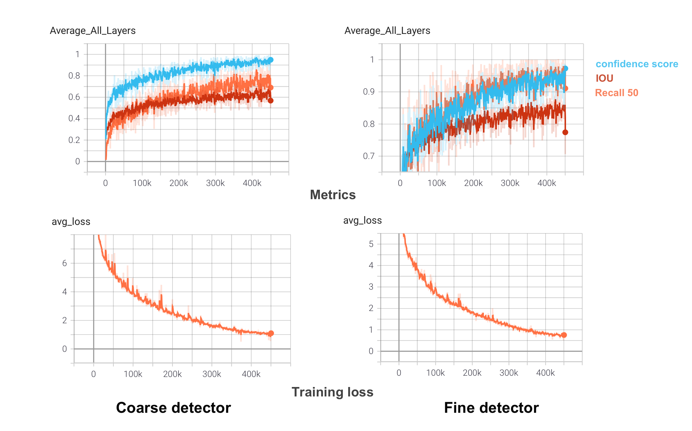
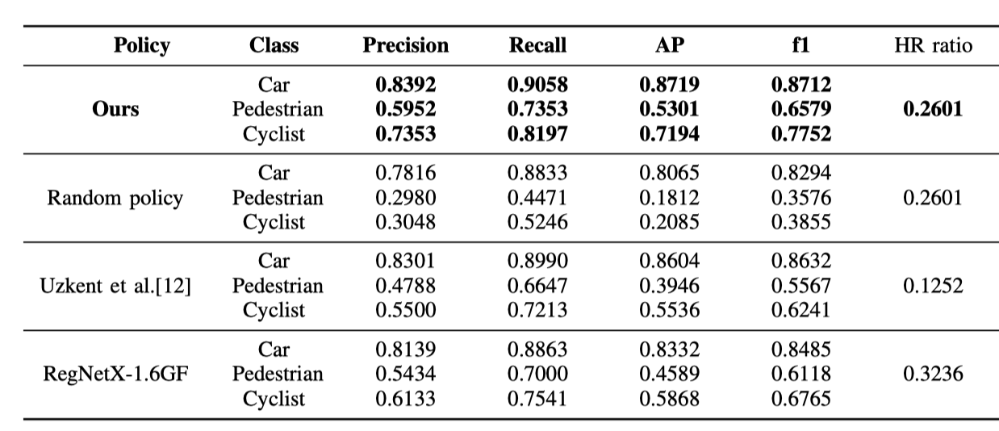
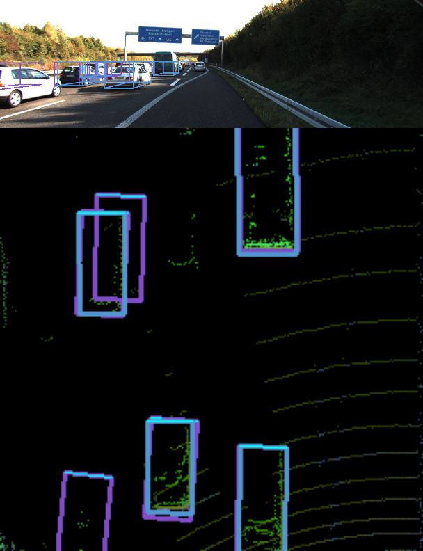

# DL-Project: Boosting the Efficiency of 3D Object Detection through Ensemble Reinforcement Learning

## 1.Instruction on how to run the code
### 1.1 Build the runnning environment
```shell script
cd code
pip install -U -r requirements.txt
```
You need to install two additional library: [`mayavi`](https://docs.enthought.com/mayavi/mayavi/installation.html) and [`shapely`](https://shapely.readthedocs.io/en/latest/project.html#installing-shapely) 
libraries. Please refer to the installation instructions from their official websites.
### 1.2 Prepare the data
Download the 3D KITTI detection dataset from [here](http://www.cvlibs.net/datasets/kitti/eval_object.php?obj_benchmark=3d).

The downloaded data includes:

- Velodyne point clouds _**(29 GB)**_
- Training labels of object data set _**(5 MB)**_
- Camera calibration matrices of object data set _**(16 MB)**_
- Left color images of object data set _**(12 GB)**_

Please make sure that you construct the source code & dataset directories structure as below.

### 1.3 Train and evaluate the detectors
Train the coarse level detector:
```shell script
python train.py --detector_type coarse --saved_fn coarse --gpu_idx 0 --batch_size <N> --num_workers <N> 
```
Train the fine level detector:
```shell script
python train.py --detector_type fine --saved_fn fine --gpu_idx 0 --batch_size <N> --num_workers <N> 
```
You can also customize your arguments in train.sh. Run ```python train.py -h``` to learn all the arguments you can specify.
We provide two pretrained models: [coarse](https://1drv.ms/u/s!AveWDyBAPlGWg7BeG5IYBgy5Mi7XQg?e=jTsimx) and [fine](https://1drv.ms/u/s!AveWDyBAPlGWg7Bde_9LS4xl3ynmDw?e=yoaPe1). You can resume training or evaluate the checkpoints.

Our training curve: 
<!---->

Evaluate the detectors
```
python evaluate.py --gpu_idx 0 --pretrained_path <PATH> --detector_type <fine or coarse>
```

### 1.4 Generate metrics on validation set for RL training
To generate supplementary texts for RL training, you need to run this code for coarse and fine detector separately.
```
python evaluate_for_RL.py --pretrained_path <PATH> --detector_type <coarse or fine> --gpu_idx 0
```
The generated idx file would contain the image name and patch index. For coarse and fine detector, the generated txt files are listed as:
  - batch_id, detection_idx, IOU, detection score, class, box_id
 where the box_id corresponds to the ground truth id in the ground truth file. You can find out how to index those values in policy_from_txt.ipynb.
 
In ```code/dataset/kitti/```, we provide some text files we generated for future training.

### 1.5 Train policy network
You can run ```sh RLtrain.sh``` to reproduce our setup, under which the network backbone is RegNetX-200mf.
To try different network architecture (options:resnet18, resnet34, resnet50, regnet1.6gf) and training parameters, you can also run:
```
python RLtrain.py --cv_dir <PATH> --model_type <MODEL> --batch_size <N> --lr <LR> ...
```

We provide three pretrained checkpoints of RegNet-200mf: [here](https://drive.google.com/file/d/1bifO6v1WXygPdrmP6mhhGyLoglhNysHD/view?usp=sharing). Unzip the file and put the folder in ```code/RLsave```, then you can directly run the following evaluation code.

### 1.6 Evaluate RL policy
Run ```python RLpolicies.py --save_txt <file_name>``` to generate the text file that stores policies. 
In ```code/RLsave```, we provide our policy text file ```regnet_policies_3_bm.txt```. You can use this file to try the following steps.
Then refer to policy_from_txt.ipynb to check the generated policies.
Our results are shown below:


<!---->

### 1.7 Visualize predictions and save policies
Use the policy file generated in Section **1.6** and detector checkpoints saved in **1.3**, you can visualize the predictions and save the visualization along with the policy results:
```
python test_two_models.py --show_image --policy_file <file_path> --load_coarse <path> --load_fine <path> --save_test_output
```
One sample is shown as below:


<!---->

## 2. Folder structure

```
${ROOT}
└── checkpoints/    
    └── (your detector checkpoints folder)/
└── RLsave/   
    ├── regnet_policies_3_bm.txt
    └── (your RL checkpoints folder)/
└── dataset/    
    └── kitti/
        ├──ImageSets/
        │   ├── train.txt
        │   └── val.txt
        ├── training/
        │   ├── image_2/ <-- for visualization
        │   ├── calib/
        │   ├── label_2/
        │   └── velodyne/
        └── testing/  
        │   ├── image_2/ <-- for visualization
        │   ├── calib/
        │   └── velodyne/ 
        └── classes_names.txt
└── src/
    ├── config/
    ├── cfg/
        │   ├── complex_yolov4_hr.cfg
        │   ├── complex_yolov4_lr.cfg
    │   ├── input_config.py
    │   ├── train_config.py
    │   └── kitti_config.py
    ├── data_process/
    │   ├── kitti_bev_utils.py
    │   ├── kitti_dataloader.py
    │   ├── kitti_dataset.py
    │   ├── RL_dataloader.py
    │   ├── kitti_data_utils.py
    │   ├── train_val_split.py
    │   └── transformation.py
    ├── models/
    │   ├── darknet2pytorch.py
    │   ├── darknet_utils.py
    │   ├── model_utils.py
    │   ├── yolo_layer.py
    └── utils/
    │   ├── evaluation_utils.py
    │   ├── iou_utils.py
    │   ├── logger.py
    │   ├── misc.py
    │   ├── torch_utils.py
    │   ├── train_utils.py
    │   ├── utils.py
    │   ├── utils_detector.py
    │   └── visualization_utils.py
    ├── evaluate.py
    ├── test.py
    ├── test_two_models.py
    ├── ... (bash files)
    ├── evaluate_for_RL.py
    ├── train.py
    ├── RLtrain.py
    ├── RLpolicies.py
    └── constants.py
├── README.md 
└── requirements.txt
```

##  3. Acknowledgements
The authors thank Prof. Fernando Perez-Cruz and Dr. Aurelien Lucchifor for their insightful lectures and this project opportunity. The authors also thank all the TAs for their great tutorial and their constructive comments on this projec
