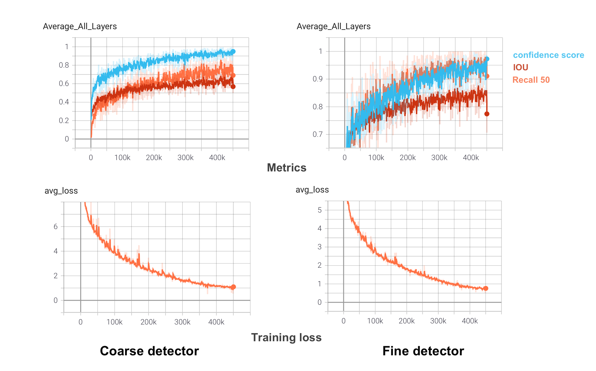
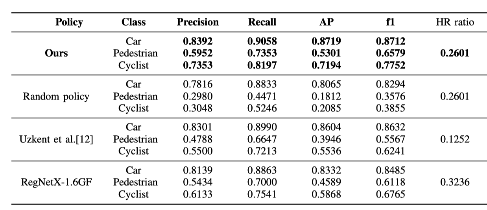

# Deep-Learning-Project

## Instruction how to use the repo

### Dataset preparation 
Please refer to the readme file in Complex-yolo directory to prepare the dataset.
### Detector training
  Please using the train.sh file for detector training. Modify the --detector_type to be fine or coarse to train our fine and coarse detector separately.
 You can find the trained detectors: [coarse]https://1drv.ms/u/s!AveWDyBAPlGWg7BeG5IYBgy5Mi7XQg?e=jTsimx) and [fine](https://1drv.ms/u/s!AveWDyBAPlGWg7Bde_9LS4xl3ynmDw?e=yoaPe1).

### Generate metrics on validation set for RL training

  Please use evaluate_for_RL.sh to etrics on validation set for RL training. Modify the detector type and save path accodingly. The generated idx file would contrain the image name and patch index. For coarse and fine detector, the generated txt files are listed as:
  - batch_id, detection_idx, IOU, detection score, class, box_id
  where the box_id coresponds to the ground truth id in the ground truth file. You can find out how to index those values in policy_from_txt.ipynb.
### RL_training
We have implemented several policy networks to use, the default choice is RegNetX-200MF, you can use otehr network structures as well (ResNet-50, RegNetX-1.6G etc). You can find our training result here:
- RL training result(using old detectors):[here](https://drive.google.com/drive/folders/1KoteVPFJXtvmmRJVrNI6yzyM-apEZtdz?usp=sharing)
- RL training result using new detectors: [here](https://1drv.ms/u/s!AveWDyBAPlGWg7BM4mo_b1jgSGPiRw?e=1LjQJT)
### Evaluate RL policy
We test our policy on a hold out set of validation set of KITTI.
- how to esnsemble here
Please refer to policy_from_txt.ipynb to check the generated policy. The result is shown below:

##  Acknowledgements
The authors thank Prof. Fernando Perez-Cruz and Dr. Aurelien Lucchifor for their insightful lectures and this project opportunity. The authors also thank all the TAs for their great tutorial and their constructive comments on this projec
